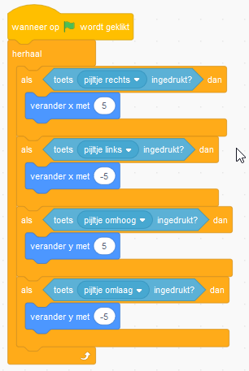
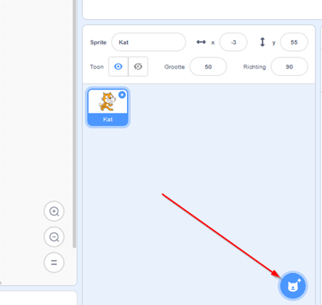
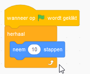
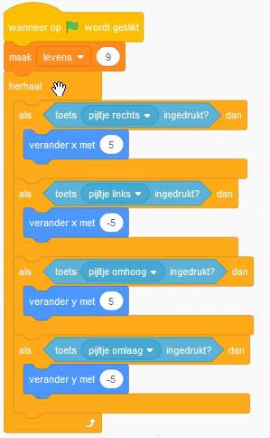
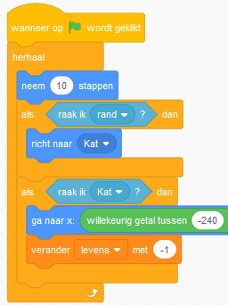
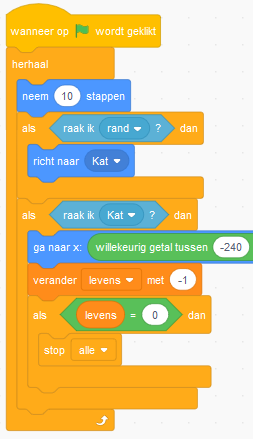
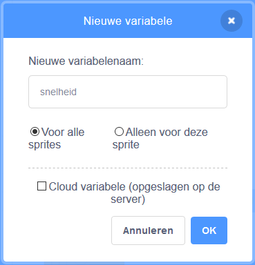

# Ontwijk de hond handleiding 

## Basisspel

Voeg de volgende gebeurtenis toe: 

 
Hiermee kun je code uitvoeren als het spel begint. Je kan bijvoorbeeld de kat laten bewegen. Voeg de volgende code toe aan de gebeurtenis om de kat te laten bewegen: 

 
Als je het spel start neemt de kat 10 stappen naar recht. Nu willen we dat de kat blijft lopen als het spel begint. Dit kan door een herhaling toe te voegen:

 
Nu blijft de kat bewegen totdat de rand van het spel wordt geraakt. De volgende stap is dat we de kat willen kunnen besturen met de pijltjestoetsen. Om dit te doen willen we dat kat alleen beweegt als we op een toets drukken. Dit kan door een 'als' blok toe te voegen met daarin een blok die kijkt of er op een toets wordt gedrukt:   

Nu beweegt de kat alleen als pijltje naar rechts wordt ingedrukt. Nu willen we ervoor zorgen dat de kat ook de andere kanten op kan bewegen:

 
Nu is er voor elke richting een toets toegevoegd. Wanneer x veranderd gaat de kat naar links of naar rechts. En wanneer y veranderd gaat de kat naar boven of naar beneden. Door een minteken ('-') voor het getal te zetten zorg je ervoor dat de kat bijvoorbeeld naar links gaat in plaats van naar rechts. 

De volgende stap is dat we een hond toevoegen. Voeg hiervoor een nieuwe sprite toe: 

Nu gaan we code toevoegen om de hond te laten bewegen. Klik hiervoor op de hond bij sprites en voeg de volgende code toe: 

Nu beweegt de hond als het spel start. Nu gaan we ervoor zorgen dat als de hond de rand van het spel raak hij in de richting van de kat beweegt: 

Om ervoor te zorgen dat de hond naar een andere plek in het spel gaat als de kat geraakt wordt voegen we nog een 'als' blok toe. In dit blok wordt een willekeurig getal gekozen zodat de hond elke keer naar een ander plek gaat: 

De eerste versie van ons spel is nu af! Maar je kan het spel natuurlijk nog verder uitbreiden. Bijvoorbeeld met de onderstaande onderdelen. Maar je kan natuurlijk ook zelf iets verzinnen. 

- Levens 
- Laat de kat sprinten 
- Muren toevoegen 
- .....

## Uitbreidingen

In de volgende hoofdstukken staat uitgelegd hoe je deze uitbreidingen zou kunnen maken. 

### Levens 

Ga naar Variabelen en kies voor 'Maak een variabele'. 

Noem de variabele 'levens'. 

Een variabele is een blok die je een bepaalde waarde kan geven. Met dit blok gaan we het aantal levens van de kat bijhouden. Aan het begin van het spel willen we dat de kat 9 levens heeft. Dit kan op de volgende manier. 

Nu gaan we ervoor zorgen dat wanneer de kat geraakt wordt de levens minder worden. Bij de code voor de hond wordt al gekeken of de kat wordt geraakt. Hier gaan we nu een blok toevoegen dat ervoor zorgt dat het aantal levens minder wordt. 

Wanneer de hond de kat raakt wordt er nu een leven afgehaald. We gaan er nu nog voor zorgen dat als het aantal levens '0' is het spel stopt. Dit kan door nog een 'als' blok toe te voegen. 

Door dit blok toe te voegen wordt er gekeken of het aantal levens nul is. Als dat zo is wordt alle code gestopt. 

 
### Laat de kat sprinten 

Ga naar Data en kies voor 'Maak een variabele'. 

Noem de variabele 'snelheid'

Een variabele is een blok die je een bepaalde waarde kan geven. Wij gaan de variabele de waarde '5' geven zodat de kat met die snelheid kan bewegen.  Dit kunnen we doen door het volgende blok toe te voegen. 

Nu gaan we het blok 'snelheid' gebruiken op de plek waar we bewegen. Verander je code op de volgende manier. 

Nu moeten we er nog voor zorgen dat de kat de goede kant opgaat voor naar links en naar beneden. Voor deze getallen stond eerst een min teken('-'). Dit kunnen we op de volgende manier doen. 

Door de snelheid keer -1 te doen gaat de kat weer de goede kant op. We hebben nu de snelheid van de kat in een variabele gestopt. Nu kunnen we de snelheid van de kat aanpassen met code. We gaan er nu voor zorgen dat de kat sneller gaat wanneer je op spatie drukt. 

De kat heeft nu de snelheid '10' wanneer je op spatiebalk drukt. Nu gaan we er nog voor zorgen dat de snelheid weer terug wordt gezet naar de normale snelheid. Dit kan met de volgende code. 

De snelheid wordt nu na 3 seconden weer normaal. 

### Muren toevoegen 

We gaan de code van de kat aanpassen zodat wanneer de kat iets zwarts raakt hij niet beweegt. Hierdoor kan de kat niet door zwarte dingen heen. Eerst gaan we onze achtergrond aanpassen door hier een zwarte muur op te tekenen. Ga eerst naar 'speelveld': 

Ga daarna naar 'achtergronden': 

Nu kunnen we de achtergrond aanpassen door er bijvoorbeeld een zwarte lijn op te tekenen: 

Nu gaan we de code van de kat aanpassen zodat hij niet door de lijn kan. Voeg het volgende 'als' blok toe aan de code: 

Zorg dat de kleur in het blok 'raak ik kleur?' zwart wordt. Dit kan door helderheid op 0 te zetten door de schuifknop onder 'Helderheid' helemaal naar links te slepen. Als de kat nu naar rechts beweegt en de zwarte lijn raakt wordt hij weer naar links verplaatst zodat hij niet beweegt. Nu moeten we hetzelfde doen voor de andere richtingen. Pas de code op de volgende manier aan: 

Nu kan de kat niet meer door de zwarte lijnen. Je kan de achtergrond nu eventueel verder aanpassen door meer lijnen toe te voegen.  